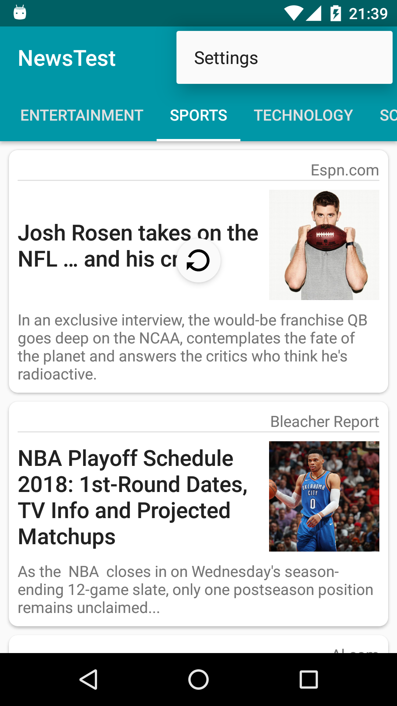
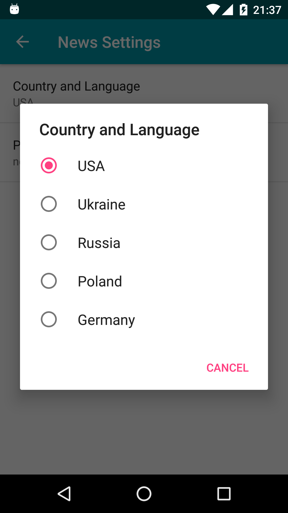

# NiceNews
A sample Android app, that displaying news by different categories. I made this project after finishing Udacity's Android Basics Nanodegree.

Updated to use Retrofit2 for network calls instead of Loaders and plain Java calls, also used ButterKnife

Features: 
- Discover most popular articles by 7 different categories
- Read news without leaving an app
- Refresh news by swiping from top
- Search for articles
- Material design

In this project I used: Fragments, ViewPager, Retrofit2, https://newsapi.org/, SharedPreferences, SettingsActivity, SearchView, RecyclerView.

Screenshots:

  
