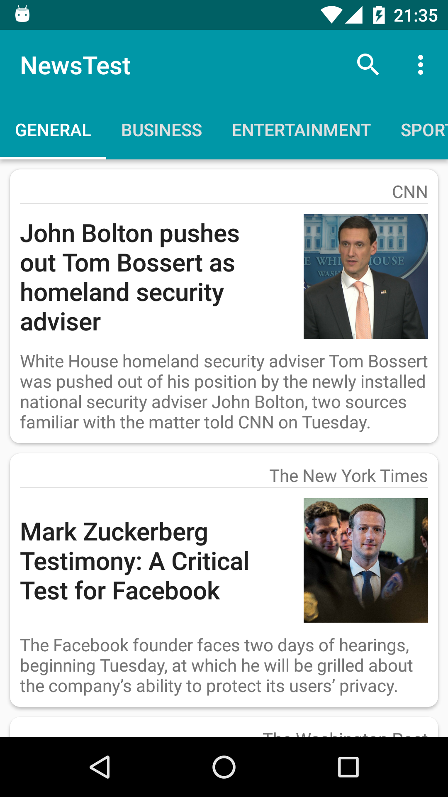

# NewsTest
A sample Android app, that displaying news by different categories. I mad this project after finishing Udacity's Android Basics Nanodegree.

Features: 
- Discover most popular articles by 7 different categories
- Read news without leaving an app
- Refresh news by swiping from top
- Search for articles
- Material design

In this project I used: Fragments, ViewPager, Networking + https://newsapi.org/, SharedPreferences, SettingsActivity, AsyncTaskLoader + LoaderCallbacks, SearchView, RecyclerView.

Screenshots:

  
